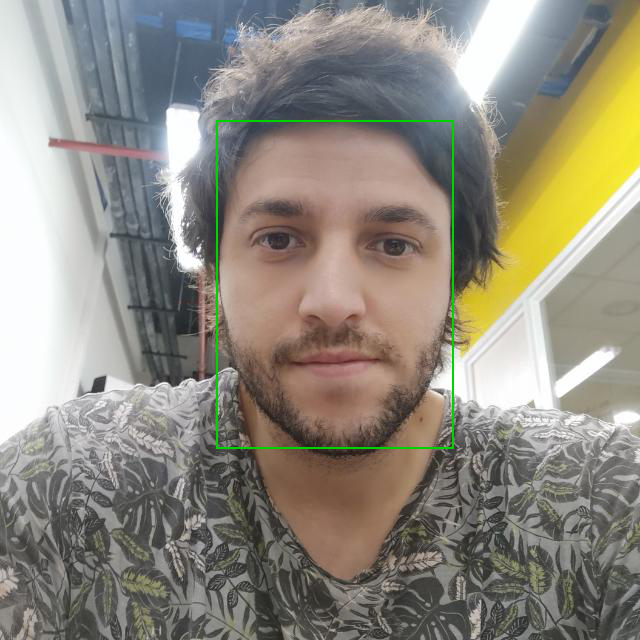

# aws-rekognition-facecompare
This repository compare a selfie with images from identity documents and response if the selfie match.

This code was made in a Python Notebook under SageMaker.

### Set up:
> - Create a Notebook Instance in SageMaker
>> - Notebook instance type : ml.t2.medium
>> - Volume Size : 5GB EBS

> - Create a role for SageMaker with the following policies:
>> - AmazonS3FullAccess
>> - AmazonRekognitionFullAccess
>> - AmazonSageMakerFullAccess

1. Create a S3 Bucket
2. Inside bucket create folder to insert the dataset images

### Code Explanation
boto3 is needed to use the aws client of S3 and Rekognition. Just like what we do with variables, data can be kept as bytes in an in-memory buffer when we use the io module’s Byte IO operations, so we can load images froms S3.
At least Pillow is needed for image plotting.
```python
import boto3
import io
from PIL import Image, ImageDraw, ExifTags, ImageColor

rekognition_client=boto3.client('rekognition')
s3_resource = boto3.resource('s3')
```

In this notebook I use two functions of AWS Rekognition

- detect_faces : Detect faces in the image. It also evaluate different metrics and create different landmarks for all elements of the face like eyes positions.
- compare_faces : Evaluate the similarity of two faces.

### Case of use
Here I explain how to compare two images

> The compare function

```python
IMG_SOURCE ="dataset-CI/imgsource.jpg"
IMG_TARGET ="dataset-CI/img20.jpg"
response = rekognition_client.compare_faces(
                SourceImage={
                    'S3Object': {
                        'Bucket': BUCKET,
                        'Name': IMG_SOURCE
                    }
                },
                TargetImage={
                    'S3Object': {
                        'Bucket': BUCKET,
                        'Name': IMG_TARGET                    
                    }
                }
)
```


> response


    {'SourceImageFace': {'BoundingBox': {'Width': 0.3676206171512604,
       'Height': 0.5122320055961609,
       'Left': 0.33957839012145996,
       'Top': 0.18869829177856445},
      'Confidence': 99.99957275390625},
     'FaceMatches': [{'Similarity': 99.99634552001953,
       'Face': {'BoundingBox': {'Width': 0.14619407057762146,
         'Height': 0.26241832971572876,
         'Left': 0.13103649020195007,
         'Top': 0.40437373518943787},
        'Confidence': 99.99955749511719,
        'Landmarks': [{'Type': 'eyeLeft',
          'X': 0.17260463535785675,
          'Y': 0.5030772089958191},
         {'Type': 'eyeRight', 'X': 0.23902645707130432, 'Y': 0.5023221969604492},
         {'Type': 'mouthLeft', 'X': 0.17937719821929932, 'Y': 0.5977044105529785},
         {'Type': 'mouthRight', 'X': 0.23477530479431152, 'Y': 0.5970458984375},
         {'Type': 'nose', 'X': 0.20820103585720062, 'Y': 0.5500822067260742}],
        'Pose': {'Roll': 0.4675966203212738,
         'Yaw': 1.592366099357605,
         'Pitch': 8.6331205368042},
        'Quality': {'Brightness': 85.35185241699219,
         'Sharpness': 89.85481262207031}}}],
     'UnmatchedFaces': [],
     'ResponseMetadata': {'RequestId': '3ae9032d-de8a-41ef-b22f-f95c70eed783',
      'HTTPStatusCode': 200,
      'HTTPHeaders': {'x-amzn-requestid': '3ae9032d-de8a-41ef-b22f-f95c70eed783',
       'content-type': 'application/x-amz-json-1.1',
       'content-length': '911',
       'date': 'Wed, 26 Jan 2022 17:21:53 GMT'},
      'RetryAttempts': 0}}

If the source image match with the target image, the json return a key "FaceMatches" with a non-empty, otherwise it returns a key "UnmatchedFaces" with a non-empty array.


```python
# Analisis imagen source
s3_object = s3_resource.Object(BUCKET,IMG_SOURCE)
s3_response = s3_object.get()
stream = io.BytesIO(s3_response['Body'].read())
image=Image.open(stream)
imgWidth, imgHeight = image.size  
draw = ImageDraw.Draw(image)  

box = response['SourceImageFace']['BoundingBox']
left = imgWidth * box['Left']
top = imgHeight * box['Top']
width = imgWidth * box['Width']
height = imgHeight * box['Height']

print('Left: ' + '{0:.0f}'.format(left))
print('Top: ' + '{0:.0f}'.format(top))
print('Face Width: ' + "{0:.0f}".format(width))
print('Face Height: ' + "{0:.0f}".format(height))

points = (
    (left,top),
    (left + width, top),
    (left + width, top + height),
    (left , top + height),
    (left, top)

)
draw.line(points, fill='#00d400', width=2)

image.show()
```

    Left: 217
    Top: 121
    Face Width: 235
    Face Height: 328





```python
# Analisis imagen target
s3_object = s3_resource.Object(BUCKET,IMG_TARGET)
s3_response = s3_object.get()
stream = io.BytesIO(s3_response['Body'].read())
image=Image.open(stream)
imgWidth, imgHeight = image.size  
draw = ImageDraw.Draw(image)
if len(response['UnmatchedFaces']) > 0:
    for face in response['UnmatchedFaces']:
        box = face['BoundingBox']
        left = imgWidth * box['Left']
        top = imgHeight * box['Top']
        width = imgWidth * box['Width']
        height = imgHeight * box['Height']
        print('UnmatchedFaces')
        print('Left: ' + '{0:.0f}'.format(left))
        print('Top: ' + '{0:.0f}'.format(top))
        print('Face Width: ' + "{0:.0f}".format(width))
        print('Face Height: ' + "{0:.0f}".format(height))

        points = (
            (left,top),
            (left + width, top),
            (left + width, top + height),
            (left , top + height),
            (left, top)

        )
        draw.line(points, fill='#ff0000', width=2)
        
if len(response['FaceMatches']) > 0:
    for face in response['FaceMatches']:
        face_match = face['Face']
        box = face_match['BoundingBox']
        left = imgWidth * box['Left']
        top = imgHeight * box['Top']
        width = imgWidth * box['Width']
        height = imgHeight * box['Height']
        print('FaceMatches')
        print('Left: ' + '{0:.0f}'.format(left))
        print('Top: ' + '{0:.0f}'.format(top))
        print('Face Width: ' + "{0:.0f}".format(width))
        print('Face Height: ' + "{0:.0f}".format(height))

        points = (
            (left,top),
            (left + width, top),
            (left + width, top + height),
            (left , top + height),
            (left, top)

        )
        draw.line(points, fill='#00d400', width=2)        
image.show()
```

    FaceMatches
    Left: 671
    Top: 1553
    Face Width: 749
    Face Height: 1008


